<h1 align="center">Relatório de Laboratório</h1>

| | |
|---|---|
| **Curso** | Engenharia de Software |
| **Disciplina** | Laboratório de Experimentação de Software |
| **Turno / Período** | Noite / 6º |
| **Professor(a)** | Danilo Maia |
| **Laboratório** | Lab02 — Impacto do Uso de Assistentes de IA na Resolução de Katas de Programação |
| **Grupo (trio)** | Arthur Luiz Alves Soares · Guilherme de Almeida Rocha Vieira · Marcos Alberto Ferreira Pinto |
| **Link do repositório / GitHub Projects** | https://github.com/Laboratorio-Medicao/Lab02 / https://github.com/orgs/Laboratorio-Medicao/projects/1 |
| **Data de entrega** | 24/09/2026 |

---

## 1. Introdução

O uso de assistentes de inteligência artificial generativa no desenvolvimento de software tem crescido rapidamente, com ferramentas como GitHub Copilot, ChatGPT e Claude sendo adotadas para geração de código, depuração e sugestão de abordagens. Apesar da adoção crescente, há poucas evidências controladas sobre o impacto real dessas ferramentas no tempo de resolução, na qualidade funcional e na estrutura do código produzido.

Este laboratório conduz um experimento controlado para investigar se o uso de um assistente de IA generativa altera o desempenho de estudantes de graduação na resolução de exercícios de programação (*katas*). O experimento adota um desenho *crossover within-subject* contrabalanceado: cada participante resolve todos os katas, metade com o assistente de IA habilitado e metade sem, de modo que cada pessoa sirva como seu próprio controle. Foram realizados **18 trials** (3 participantes × 6 katas). O estudo responde às seguintes questões de pesquisa:

- **RQ1.** Qual o impacto do uso de assistente de IA no tempo necessário para resolver uma tarefa de programação? *(métrica: tempo até passar nos testes — *time-to-green* — em segundos, censurado no time-box de 35 min)*
- **RQ2.** Como o uso de assistente de IA afeta a taxa de sucesso nos testes de aceitação do código produzido? *(métricas: taxa de sucesso nos testes de aceitação e número de testes falhando ao final do trial)*
- **RQ3.** Como o uso de assistente de IA afeta a estrutura do código produzido? *(métricas: complexidade ciclomática média — CC — e percentual de linhas duplicadas, com LOC como métrica de controle e índice de manutenibilidade — MI — como aprofundamento)*

Como aprofundamento opcional, o grupo também registrou o número de prompts usados nos trials com IA e decompôs o MI nos componentes da sua fórmula (seções 3.6 e 4.6).

### Hipóteses

As hipóteses foram fixadas no desenho da S01 (`docs/experiment_design.md`, Issue #3) e são testadas com o teste de Wilcoxon pareado (seção 3.2).

#### RQ1 — Tempo

- **H0:** o uso de assistente de IA **não reduz** o tempo necessário para resolver uma tarefa de programação.
- **H1:** o uso de assistente de IA **reduz** o tempo necessário para resolver uma tarefa de programação.

**Direção do teste:** unilateral, porque a RQ pergunta se o assistente *reduz* o tempo.

#### RQ2 — Defeitos

- **H0:** o uso de assistente de IA **não reduz** a quantidade de defeitos (testes que falham) no código produzido.
- **H1:** o uso de assistente de IA **reduz** a quantidade de defeitos (testes que falham) no código produzido.

**Direção do teste:** unilateral, porque a RQ pergunta se o assistente *reduz* os defeitos.

#### RQ3 — Estrutura do código

- **H0:** o uso de assistente de IA **não altera** a complexidade ciclomática nem a duplicação do código produzido.
- **H1:** o uso de assistente de IA **altera** a complexidade ciclomática e/ou a duplicação do código produzido.

**Direção do teste:** bilateral, porque a RQ pergunta se o assistente *altera* essas métricas, sem direção prevista.

---

## 2. Contexto

Este é o Lab02 da disciplina de Laboratório de Experimentação de Software, organizado em três sprints: S01 (desenho e preparação do experimento), S02 (execução e coleta de dados) e S03 (análise de resultados e visualização), seguidas do Relatório Final.

O objeto de estudo são **seis katas autorais em Python**, escritos pelo próprio grupo para este experimento, cada um com testes automatizados de aceitação. Os três integrantes do trio foram os participantes. O assistente de IA fixado para todos os trials com IA foi o **Claude Code com o modelo Claude Sonnet 5** (`claude-sonnet-5`, Anthropic). Os dados dos trials foram versionados no repositório entre 16 e 17/09/2026.

---

## 2.1 Estrutura GQM

O experimento segue o modelo **Goal-Question-Metric** (BASILI; CALDIERA; ROMBACH, 1994): um objetivo de investigação, do qual derivam as três questões de pesquisa do enunciado (RQ1–RQ3), cada uma respondida por métricas definidas antes da coleta.

### Goal (G1)

> **Analisar** o uso de assistentes de IA generativa na resolução de tarefas de programação
> **com o propósito de** comparar seu efeito frente à codificação manual
> **com respeito a** tempo de resolução, qualidade funcional (defeitos) e qualidade estrutural do código produzido
> **do ponto de vista do** grupo pesquisador
> **no contexto de** katas de dificuldade equivalente resolvidos por estudantes de graduação sob condições controladas (crossover within-subject, time-boxed).

### Árvore GQM

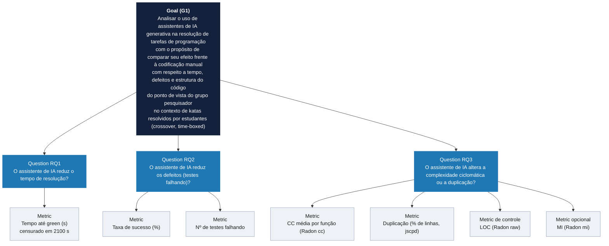

**Versão em texto (fallback para exportação em PDF, caso o renderizador não suporte Mermaid):**

```
Goal (G1): Analisar o uso de assistentes de IA generativa na resolução de
  tarefas de programação
  com o propósito de comparar seu efeito frente à codificação manual
  com respeito a tempo de resolução, qualidade funcional (defeitos) e
    qualidade estrutural do código produzido
  do ponto de vista do grupo pesquisador
  no contexto de katas de dificuldade equivalente resolvidos por estudantes
    de graduação (crossover within-subject, time-boxed)

├─ Question RQ1 — O assistente de IA reduz o tempo de resolução?
│    └─ Metric: Tempo até green (s), censurado em 2100 s
├─ Question RQ2 — O assistente de IA reduz os defeitos (testes falhando)?
│    ├─ Metric: Taxa de sucesso (% de testes passando)
│    └─ Metric: Nº de testes falhando (complementar)
└─ Question RQ3 — O assistente de IA altera a complexidade ciclomática
     ou a duplicação?
     ├─ Metric: CC média por função (Radon cc)
     ├─ Metric: Duplicação (% de linhas duplicadas, jscpd)
     ├─ Metric de controle: LOC (Radon raw)
     └─ Metric opcional: MI (Radon mi)
```

### Tabela de Registro

| Question (RQ) | Metric | Definição Operacional | Responsável (coleta / análise) |
|---|---|---|---|
| RQ1 | Tempo até *green* | `elapsed_seconds` de `data/trials.csv`; 2100 s quando `censored = True` | Marcos Alberto (#5, cronômetro) / Arthur Soares (#15) |
| RQ2 | Taxa de sucesso | `tests_passing / tests_total × 100` (`success_rate_percent`) | Marcos Alberto (#5, #41) / Arthur Soares (#15) |
| RQ2 | Nº de testes falhando | `tests_failing` | Marcos Alberto (#5, #41) / Arthur Soares (#15) |
| RQ3 | CC média | média da CC por função/método (`radon cc`) | Marcos Alberto (#5) / Marcos Alberto (#16) |
| RQ3 | Duplicação | `duplicated_lines_percent` do jscpd, blocos ≥ 5 linhas e 20 tokens, testes excluídos | Arthur Soares (#6) / Marcos Alberto (#16) |
| RQ3 | LOC (controle) | `loc` bruto do `radon raw` | Marcos Alberto (#5) / Marcos Alberto (#16) |
| RQ3 | MI (opcional) | `radon mi`, média dos arquivos `.py` do diretório do trial | Marcos Alberto (#5) / Marcos Alberto (#16, #18) |
| Bônus | Nº de prompts | autorrelato em `data/prompts/prompt_records.csv` | Guilherme Vieira (#12) / Marcos Alberto (#18) |

Responsáveis conforme os Assignees e os commits das Issues citadas (seção 3.3.6).

### Tabela de Métricas consolidada (GQM × Seção 3.5)

A tabela abaixo justifica a escolha de cada métrica, ligando RQ → métrica → o que ela mede → por que ela responde à RQ. As definições operacionais, unidades e fontes estão na seção 3.5.

| Goal | Question (RQ) | Metric | O que mede | Por que responde à RQ |
|---|---|---|---|---|
| G1 | RQ1 | **Tempo até *green*** | Tempo do início do trial até todos os testes de aceitação passarem | "Resolver a tarefa" é operacionalizado como passar nos testes de aceitação. É a métrica primária recomendada pelo enunciado; a censura evita descartar trials sem sucesso. Agregada pela mediana, por causa do N pequeno |
| G1 | RQ2 | **Taxa de sucesso** | Fração dos testes de aceitação que o código final satisfaz | O enunciado define defeito como teste de aceitação falhando. A porcentagem normaliza katas com 5 a 7 testes |
| G1 | RQ2 | **Nº de testes falhando** (complementar) | Contagem absoluta de testes falhando | Forma direta de reportar defeitos, complementar à taxa |
| G1 | RQ3 | **CC média** por função | Nº de caminhos independentes de execução (McCabe) | Mede diretamente a complexidade ciclomática citada na RQ3; o Radon é a ferramenta equivalente ao CK para Python |
| G1 | RQ3 | **Duplicação** | Linhas em blocos repetidos | Mede diretamente a duplicação citada na RQ3; o Radon não cobre duplicação |
| G1 | RQ3 | **LOC** (controle) | Tamanho do código | O enunciado exige LOC sempre que se reporta complexidade/duplicação: código com IA pode ser mais verboso, e CC sem controle de tamanho pode enganar |
| G1 | RQ3 | **MI** (opcional) | Índice composto de CC, linhas e volume de Halstead | Resume a manutenibilidade num único índice; é opcional no enunciado e foi incluído pelo grupo |
| — | — | **Nº de prompts** (opcional, exploratório) | Interações com o assistente nos trials com IA | Apoia só a discussão qualitativa; não responde a nenhuma RQ |

A densidade de defeitos (testes falhando/KLOC), também opcional no enunciado, não foi usada.

---

## 3. Metodologia

### 3.1 Principais Desafios

**Tamanho amostral:** com 3 participantes, o teste pareado tem apenas 3 pares. O menor p que o Wilcoxon exato pode produzir é 1/2³ = 0,125 (unilateral) ou 0,25 (bilateral), acima de α = 0,05. Nenhuma diferença, por maior que seja, pode ser declarada significativa nesta amostra (seção 3.2).

**Medição de defeitos acoplada ao encerramento do trial:** o cronômetro encerra o trial no *green* (todos os testes passando) ou no time-box. Uma taxa de sucesso abaixo de 100% só pode aparecer em trial censurado, o que torna a RQ2 dependente da censura da RQ1 (seção 4.3).

**Confundimento entre tratamento e kata:** na atribuição executada, cada participante resolveu katas diferentes em cada tratamento (seção 3.3.1).

**Proveniência dos tempos:** o modo do cronômetro usado em cada trial não foi registrado e os tempos com IA de Marcos só têm confirmação por autorrelato (seção 3.3.4).

**MI com duas convenções:** o coletor calcula o MI como média dos arquivos `.py` do diretório do trial, e parte dos diretórios tinha um `__init__.py` vazio no momento da coleta (seção 4.4).

**Soluções de referência no repositório:** as soluções de referência dos katas ficaram versionadas no repositório compartilhado antes dos trials (seção 3.3.3).

### 3.2 Tomadas de Decisão

**Python + Radon + jscpd:** o enunciado permite uma ferramenta equivalente ao CK/PMD quando a linguagem não é Java. O Radon mede CC, MI e LOC; como não mede duplicação, o jscpd foi usado para ela.

**Assistente único:** Claude Code com o modelo Claude Sonnet 5 em todos os trials com IA, como exige o enunciado.

**Time-box mantido em 35 min**, sem redução.

**Estatística descritiva por mediana e IQR** (Q3 − Q1) por tratamento, como recomenda o enunciado para N pequeno. Média e desvio-padrão não são usados como estatística descritiva. Os quartis seguem `statistics.quantiles(method="inclusive")`.

**Outliers** pelas cercas de Tukey (Q1 − 1,5·IQR e Q3 + 1,5·IQR), calculadas por tratamento. Um outlier é uma observação extrema, não um dado inválido: todos foram **sinalizados e mantidos**, e nenhuma observação foi removida.

**Censura:** trials que atingem o time-box entram na análise com o tempo travado em 2100 s, nunca descartados.

**Teste inferencial:** Wilcoxon signed-rank pareado, exato (CONOVER, 1999), com α = 0,05. O Wilcoxon foi escolhido por ser não paramétrico e adequado ao desenho within-subject. Nenhum artefato da S01/S02 fixava um α; o valor foi declarado na S03.

- **Unidade de pareamento: o participante (N = 3 pares).** Nenhum participante resolveu o mesmo kata nos dois tratamentos, então não existe par participante × kata. O par de cada participante compara o resumo dos seus 3 trials com IA contra o resumo dos seus 3 trials sem IA: a mediana na RQ1 e na RQ3, e a média na RQ2. A RQ2 usa a média porque, com a mediana, um único trial com testes falhando não alteraria o par.
- **Direção:** unilateral na RQ1 e na RQ2 (H1 "reduz"); bilateral na RQ3 (H1 "altera").
- **Limite de resolução do teste:** com 3 pares não nulos, o menor p possível é **0,125 (unilateral)** ou **0,25 (bilateral)**, os dois acima de α. Por isso a leitura dos resultados se apoia principalmente na estatística descritiva, e uma H0 não rejeitada aqui **não** é evidência de ausência de efeito.

**Tamanho de efeito:** o material de apoio usado pelo grupo recomenda reportá-lo sempre — "Reporte sempre o tamanho de efeito (Cohen's d, Cliff's δ, A12)" (BATELLA et al., 2026). Esta análise usa medidas ligadas ao próprio teste pareado:

- **RQ1:** diferença entre medianas e razão com IA / sem IA. A correlação bisserial de postos não é reportada porque, com as três diferenças no mesmo sinal, ela vale necessariamente ±1 e não informa nada.
- **RQ3:** correlação bisserial de postos pareada (r_rb), definida a partir dos postos com sinal do próprio Wilcoxon e que não depende da aproximação normal com N pequeno (justificativa em `results/rq3/rq3_summary.md`, seção 11, item 10).

**RQ3 — métricas e multiplicidade:** CC e duplicação (as métricas da RQ), LOC como controle, CC/LOC (métrica derivada, para separar complexidade de tamanho) e MI como aprofundamento. Como são vários testes, os p-valores brutos são reportados ao lado dos ajustados por Bonferroni e Benjamini–Hochberg dentro de cada família de testes, seguindo a recomendação "Muitos testes? Corrija (Bonferroni / FDR)" (BATELLA et al., 2026).

**Análises de sensibilidade:** pareamento por kata (N = 6) e MI recalculado sob convenção única (RQ3).

**Mann-Whitney:** a Issue #17 implementou o teste de Mann-Whitney (`experiment/analysis/rank_sum.py`) para as figuras que produziu. Esse teste trata como independentes os trials do mesmo participante, o que o desenho não garante. As figuras da #17 foram substituídas pelas deste relatório, e **os p-valores do Mann-Whitney não fazem parte dos resultados**: não aparecem nas tabelas nem entram em nenhuma decisão sobre H0.

### 3.3 Etapas

#### 3.3.1 Desenho experimental

O experimento usa um desenho **crossover within-subject**. Cada um dos três participantes resolve os seis katas individualmente, sob time-box de 35 minutos por trial. A variável independente é a presença ou ausência do assistente de IA durante a resolução. Cada participante fez metade dos trials com IA e metade sem IA (3 + 3), totalizando 18 trials: 9 com IA e 9 sem IA.

**Atribuição executada** (a que gerou os dados; conferida em `data/trials.csv` e em `docs/experiment_design.md`):

| Participante | Com IA | Sem IA |
|---|---|---|
| Guilherme | kata-01, kata-02, kata-03 | kata-04, kata-05, kata-06 |
| Arthur | kata-01, kata-03, kata-05 | kata-02, kata-04, kata-06 |
| Marcos | kata-04, kata-05, kata-06 | kata-01, kata-02, kata-03 |

**Atribuição planejada na S01** (Issue #3, commit `906bafc`, 2026-09-06): Guilherme 1–3 com IA / 4–6 sem IA; Arthur 1–3 sem IA / 4–6 com IA; Marcos 1–3 com IA / 4–6 sem IA.

#### 3.3.2 Participantes

Os três participantes são Arthur Luiz Alves Soares, Guilherme de Almeida Rocha Vieira e Marcos Alberto Ferreira Pinto, estudantes do 6º período de Engenharia de Software, com conhecimento de Python. Os três são também os autores do experimento: os katas foram escritos pelo próprio grupo, e as soluções de referência ficaram versionadas no repositório antes dos trials (seção 3.3.3).

A confirmação individual e registrada de uso do assistente fixado existe apenas para os três trials com IA de Marcos (autorrelato em `docs/experiment_design.md`); para Arthur e Guilherme não há confirmação equivalente por escrito.

**Familiaridade prévia com assistentes de IA (autorrelato).** O nível de familiaridade foi registrado em `data/participant_ai_familiarity.csv` por autoavaliação relativa dentro do trio, sem instrumento padronizado:

| Participante | Familiaridade declarada |
|---|---|
| Guilherme | Intermediária |
| Arthur | Intermediária |
| Marcos | Intermediária |

Os três declaram uso de assistentes de IA em estágio profissional. Esses níveis são **autorrelato**, não uma medição objetiva. Eles são usados apenas na discussão qualitativa (seção 5.2).

#### 3.3.3 Objetos experimentais (katas)

Foram usados seis exercícios autorais, escritos para este experimento em 07/09/2026, com o objetivo de reduzir o risco de memorização pelo assistente de IA. Os exercícios exigem uma única função principal, usam apenas tipos básicos de Python e têm entre 5 e 7 testes de aceitação cada (36 no total). No planejamento (S01), a dificuldade foi estimada como equivalente entre os seis. Os dados coletados mostraram, porém, variação relevante de tamanho e complexidade entre os katas; o kata-04, por exemplo, teve a maior CC média (seção 4.4).

| ID | Exercício | Testes |
|---|---|---:|
| kata-01 | Faixas de sinal | 5 |
| kata-02 | Inventário de bolsos | 6 |
| kata-03 | Grade de entregas | 7 |
| kata-04 | Marcadores de texto | 6 |
| kata-05 | Rodízio de equipes | 7 |
| kata-06 | Pontuação por vizinhança | 5 |

Os testes de aceitação são fixos e idênticos para todos os participantes. A solução de cada participante está em `katas/participants/<participante>/kata_XX/solution.py`. Os 18 `test_solution.py` dos participantes são idênticos aos do oráculo, ou seja, nenhum teste foi alterado.

**Soluções de referência.** Cada `katas/kata_XX/` contém uma `solution.py` de referência, usada para validar o oráculo. Elas foram versionadas no repositório compartilhado em 2026-09-07 (commit `6f79179`, Issue #4), nove dias antes dos trials (16–17/09). O protocolo (`docs/katas.md`) previa iniciar cada trial com a implementação removida.

**Baixa indexação.** Os katas são autorais, o que reduz o risco de memorização pelo assistente. A busca pelos títulos e frases dos enunciados, prevista em `docs/katas.md` para ser anexada a este relatório, **não foi registrada**; a baixa indexação se apoia só na autoria.

#### 3.3.4 Coleta de dados

Para cada trial foram registrados:

- **Tempo (RQ1):** o instrumento previsto é o script `experiment/collection/timer.py`, com dois modos: (a) o participante pressiona ENTER quando os testes passam (autodeclaração); (b) com `--kata-path`, o script roda `pytest` a cada 5 s e para no primeiro *green*. Trials que atingem o time-box sem sucesso são registrados como censurados, com tempo travado em 35 min. **O modo usado em cada trial não foi registrado**, e `data/trials.csv` não guarda horário de início.

- **Defeitos (RQ2):** número de testes falhando e taxa de sucesso ao final do trial, derivados da execução do `pytest` sobre a solução do participante. Como o trial termina no *green* ou no time-box, um valor abaixo de 100% só pode ocorrer em trial censurado (seção 4.3).

- **Métricas estáticas (RQ3):** coletadas via `experiment/collection/static_metrics.py` sobre o diretório de cada trial (`katas/participants/<participante>/kata_XX/`), excluindo os arquivos de teste, e acumuladas em `data/static_metrics.csv`:
    - **CC** (complexidade ciclomática média por função) via `radon cc`;
    - **MI** (índice de manutenibilidade, escala 0–100) via `radon mi`, como média dos arquivos `.py` do diretório — por isso a série coletada mistura duas convenções (seção 4.4);
    - **LOC** (linhas de código) via `radon raw`, usada como variável de controle;
    - **Duplicação** (% de linhas duplicadas) via `jscpd`.

- **Dados qualitativos (bônus):** número de prompts, tipos de ajuda e percepção de produtividade (Likert 1–5) em `data/prompts/prompt_records.csv` (12 linhas: os 9 trials com IA e os 3 sem IA de Arthur).

#### 3.3.5 Ameaças à validade previstas no desenho

A classificação segue as categorias usuais de validade em experimentos de Engenharia de Software (WOHLIN et al., 2012). O que se concretizou na execução é discutido na seção 5.2.

- **Efeito de aprendizado** *(validade interna):* o plano da S01 previa mitigação por contrabalanceamento em blocos opostos entre participantes.
- **Familiaridade prévia com o assistente de IA** *(validade interna):* participantes mais experientes com IA podem obter ganhos maiores no tratamento com IA. Mitigação prevista: registrar a familiaridade e tratá-la como variável de confusão na discussão. Os níveis registrados são autorrelato (seção 3.3.2), e com 3 participantes não há como controlar essa variável estatisticamente.
- **Memorização pelo assistente de IA** *(validade interna):* reduzida pelo uso de katas autorais; a busca que comprovaria a baixa indexação não foi registrada (seção 3.3.3).
- **Tamanho amostral reduzido** *(conclusão estatística):* 3 participantes limitam o poder estatístico; análise não paramétrica e interpretação descritiva complementam os resultados.
- **Generalização limitada** *(validade externa):* os resultados se aplicam ao contexto de estudantes de graduação resolvendo katas em Python com o assistente Claude Code (Claude Sonnet 5).

#### 3.3.6 Execução por sprint (Issues)

Responsáveis conforme os Assignees registrados em cada Issue no GitHub.

**S01 — Desenho e Preparação do Experimento**

| Issue | Título | Responsável |
|---|---|---|
| #3 | Desenho do experimento: hipóteses, variáveis e protocolo crossover | Guilherme Vieira |
| #4 | Seleção e validação dos katas (6 exercícios, baixa indexação) | Arthur Soares |
| #5 | Script de cronometragem e coleta de métricas estáticas (Radon) | Marcos Alberto |
| #6 | (Bônus) Script de detecção de duplicação de código via jscpd/PMD CPD | Arthur Soares |
| #24 | Preparação do ambiente de execução (linguagem, IDE, assistente de IA) | Marcos Alberto |
| #25 | Snapshot do Kanban (Sprint 1) | Guilherme Vieira |
| #35 | Sincroniza gerador do desenho e da coleta (métricas, katas, cronômetro) | Marcos Alberto |

**S02 — Execução do Experimento**

| Issue | Título | Responsável |
|---|---|---|
| #9 | Trials de execução: Guilherme (katas 1–6, ordem contrabalanceada) | Guilherme Vieira |
| #10 | Trials de execução: Arthur (katas 1–6, ordem contrabalanceada) | Arthur Soares |
| #11 | Trials de execução: Marcos (katas 1–6, ordem contrabalanceada) | Marcos Alberto |
| #12 | (Bônus) Consolidação dos dados de prompts e registro de dificuldades qualitativas | Guilherme Vieira |
| #26 | Snapshot do Kanban (Sprint 2) | Arthur Soares |
| #41 | Sincroniza schema de coleta, documenta desvio de contrabalanceamento e completa autorrelatos | Marcos Alberto |

**S03 — Análise, Visualização e Dashboard**

| Issue | Título | Responsável |
|---|---|---|
| #15 | Testes estatísticos (Wilcoxon) e análise descritiva RQ1 e RQ2 | Arthur Soares, Guilherme Vieira |
| #16 | Análise de métricas estáticas RQ3 (complexidade ciclomática, MI, LOC, duplicação) | Marcos Alberto |
| #17 | Dashboard de visualização (Pandas + Matplotlib/Seaborn) | Arthur Soares |
| #18 | (Bônus) Análise do Índice de Manutenibilidade e correlação com nº de prompts | Marcos Alberto |
| #27 | Snapshot do Kanban (Sprint 3) | Marcos Alberto |

**Relatório Final**

| Issue | Título | Responsável |
|---|---|---|
| #20 | Introdução, hipóteses e metodologia detalhada | Arthur Soares, Guilherme Vieira |
| #21 | Resultados e discussão RQ1, RQ2 e RQ3 | Marcos Alberto |
| #22 | Discussão final, ameaças à validade e conclusão | Guilherme Vieira |
| #23 | Revisão final, snapshot do Kanban e exportação PDF | Arthur Soares, Guilherme Vieira, Marcos Alberto |

Cada sprint também tem um card pai (#1, #7, #13, #19) e um card de refinamento (#2, #8, #14).

#### Configuração do processo — GitHub Projects

O grupo usou um **GitHub Projects** no formato Kanban. As colunas registradas nos snapshots exportados do board (`data/kanban-snapshots/`) são:

| Coluna | Descrição |
|---|---|
| **Backlog** | Tarefas identificadas, ainda não iniciadas |
| **In progress** | Tarefas em andamento |
| **Done** | Tarefas concluídas |

**Limite de WIP (Work in Progress):** `6 itens na coluna In progress`

**Justificativa:** o grupo tem 3 integrantes, e o ideal é que cada um tenha no máximo 2 tarefas em andamento ao mesmo tempo (3 × 2 = 6).

**Link do board:** https://github.com/orgs/Laboratorio-Medicao/projects/1

**Print do board:**

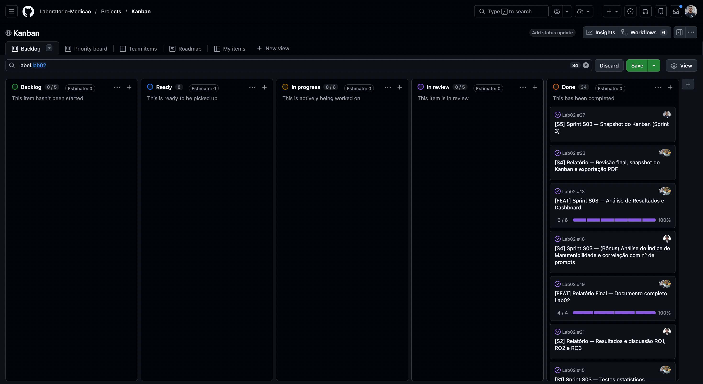

*Figura — Board do GitHub Projects filtrado por `label:lab02` ao final da Sprint 3. Todas as 34 issues estão na coluna Done.*

### 3.4 Ferramentas

A tabela separa a versão fixada para o experimento do que pode ser comprovado sobre a execução real.

| Ferramenta | Versão fixada / documentada | Comprovação da versão usada nos trials | Uso |
|---|---|---|---|
| **Python** | mínimo 3.10 (README) | não registrada no experimento. Na máquina de Marcos, caches locais não versionados (`*.cpython-314.pyc` de 2026-09-16) indicam CPython 3.14; para Arthur e Guilherme não há evidência. Análise da S03 reexecutada com Python 3.14.5 | Linguagem dos katas e dos scripts |
| **Claude Code** (modelo Claude Sonnet 5, `claude-sonnet-5`) | modelo fixado no README | **versão do Claude Code não registrada**; uso confirmado por escrito apenas por Marcos | Assistente de IA nos trials com IA |
| **Visual Studio Code** | — | versão não registrada | IDE |
| **pytest** | 9.1.1 (`requirements.txt`) | fixada; mesma versão no ambiente de análise | Testes de aceitação e testes do projeto |
| **Radon** | 6.0.1 (`requirements.txt`) | gravada por trial em `data/static_metrics.csv` (`cc_mi_tool_version`) em 18/18 trials | CC, MI e LOC |
| **jscpd** | 4.0.5 (`package-lock.json`) | gravada por trial (`duplication_tool_version`) em 18/18 trials | Duplicação |
| **numpy, pandas, scipy, matplotlib** | 2.5.3, 3.0.6, 1.18.1, 3.11.2 (`requirements.txt`) | fixadas; análises e figuras reexecutadas sem diferença | Análise estatística e figuras |
| **GitHub Projects** | — | — | Gestão do processo — https://github.com/orgs/Laboratorio-Medicao/projects/1 |

### 3.5 Tabela de Métricas

| RQ | Métrica | Definição Operacional | Unidade | Ferramenta / Fonte |
|---|---|---|---|---|
| RQ1 | Tempo até *green* | Tempo do início do trial até todos os testes de aceitação passarem; 2100 s se o time-box for atingido (`censored = True`) | Segundos | `experiment/collection/timer.py` → `data/trials.csv` (`elapsed_seconds`) |
| RQ2 | Taxa de sucesso | `tests_passing / tests_total × 100` ao final do trial | % | pytest → `data/trials.csv` (`success_rate_percent`) |
| RQ2 | Nº de testes falhando | `tests_failing` ao final do trial | Contagem | pytest → `data/trials.csv` |
| RQ3 | CC média | Média da complexidade ciclomática por função/método do trial | Adimensional | Radon `cc` → `data/static_metrics.csv` (`cyclomatic_complexity_avg`) |
| RQ3 | Duplicação | % de linhas em blocos duplicados (mín. 5 linhas e 20 tokens), testes excluídos | % de linhas | jscpd → `data/static_metrics.csv` (`duplicated_lines_percent`) |
| RQ3 | LOC (controle) | `loc` bruto do Radon (inclui linhas em branco e comentários) | Linhas | Radon `raw` → `data/static_metrics.csv` (`loc`) |
| RQ3 | CC/LOC (derivada) | CC média ÷ LOC | Complexidade por linha | calculada em `experiment/analysis/rq3.py` |
| RQ3 | MI (opcional) | Como coletado: média do `radon mi` dos arquivos `.py` do diretório; harmonizado: `radon mi` só do `solution.py` | 0–100 | Radon `mi` → `data/static_metrics.csv`; harmonizado em `results/rq3/source_integrity_check.csv` (`mi_source_only`) |
| Bônus | Nº de prompts | Interações com o assistente declaradas pelo participante | Contagem | Autorrelato → `data/prompts/prompt_records.csv` |

### 3.6 Inovações Propostas pelo Grupo

**Verificação cruzada das métricas estáticas.** A análise da RQ3 recalcula LOC, CC e MI a partir do código versionado de cada trial e compara com o CSV coletado na S02 (`results/rq3/source_integrity_check.csv`). LOC e CC conferem em 18/18 trials; a verificação revelou as duas convenções de MI e deu origem à série harmonizada (seção 4.4).

**Análises de sensibilidade.** Além do teste principal (pareado por participante), o grupo repetiu os testes da RQ3 pareando por kata (N = 6) e com o MI harmonizado, e mediu o desequilíbrio de dificuldade dos katas entre os tratamentos (`results/rq3/task_allocation_balance.csv`).

**Cronômetro com verificação automática do *green*.** O `timer.py` pode rodar o `pytest` a cada 5 s e parar sozinho no primeiro *green* (`--kata-path`), em vez de depender da autodeclaração do participante. O modo usado em cada trial, porém, não foi registrado (seção 3.3.4).

**Bônus — MI em profundidade e nº de prompts (Issues #12 e #18).** O grupo decompôs o MI nos componentes da fórmula do Radon e cruzou o nº de prompts com CC, MI e LOC nos trials com IA. É uma análise exploratória, sem testes de hipótese (seção 4.6).

---

## 4. Resultados

Os números das tabelas e dos testes desta seção são calculados pelos scripts da S03 a partir de `data/trials.csv` e `data/static_metrics.csv`, sem valores fixos no código: `python analyze_rq1_rq2.py` (RQ1 e RQ2, Issue #15, saída completa em [`docs/analysis_rq1_rq2.md`](analysis_rq1_rq2.md)), `python -m experiment.analysis.rq3` (RQ3, Issue #16, saída completa em [`results/rq3/rq3_summary.md`](../results/rq3/rq3_summary.md)) e `python -m experiment.analysis.mi_prompts` (bônus, Issue #18, saída em [`results/mi_prompts/mi_prompts_summary.md`](../results/mi_prompts/mi_prompts_summary.md)). As Figuras 1 a 10 são geradas por `python generate_figures.py` a partir dessas mesmas análises, em PNG e PDF, em `docs/figures/`. Cada figura responde a uma única pergunta e não traz p-valores, que ficam nas tabelas.

### 4.1 Coleta de Dados

Foram analisados os **18 trials** (3 participantes × 6 katas; 9 com IA e 9 sem IA). Nenhum foi excluído e **nenhum foi censurado**: todos chegaram ao *green* antes do time-box de 35 min.

| Métrica | N válido | Excluídos | Observação |
|---|---|---|---|
| RQ1 — Tempo até *green* | 18 | 0 | 0 censurados; 2 outliers sinalizados e mantidos |
| RQ2 — Taxa de sucesso / testes falhando | 18 | 0 | Todos os trials com 100% de sucesso e 0 testes falhando |
| RQ3 — CC | 18 | 0 | Recalculada a partir do código: confere em 18/18 |
| RQ3 — LOC | 18 | 0 | Recalculada a partir do código: confere em 18/18 |
| RQ3 — Duplicação | 18 | 0 | 0% em todos os trials |
| RQ3 — MI como coletado | 18 | 0 | Duas convenções de cálculo (seção 4.4) |
| RQ3 — MI harmonizado | 18 | 0 | Recalculado sob convenção única |
| Bônus — Nº de prompts | 9 | — | Trials com IA; os 3 registros sem IA de Arthur não entram na análise |

**Casos especiais identificados:**

- **Proveniência dos tempos:** os 3 tempos com IA de Marcos só têm confirmação por autorrelato (seção 3.3.4). Mantidos na análise, com ressalva.
- **MI com duas convenções:** 12 valores (Arthur e Marcos) incluem na média um `__init__.py` vazio; 6 (Guilherme), não. Mantidos sem alteração; a série harmonizada é usada como sensibilidade (seção 4.4).
- **Confundimento tratamento × kata:** cada participante resolveu katas diferentes em cada tratamento (seção 3.3.1).

### 4.2 RQ1 — Tempo até *green*

> **H0:** o uso de assistente de IA não reduz o tempo necessário para resolver uma tarefa de programação. **H1:** reduz.

**Tabela 1 — Tempo até *green* por tratamento (segundos)**

| Tratamento | n | Mediana | Q1 – Q3 | IQR | Mín – Máx | Censurados |
|---|---:|---:|---:|---:|---:|---:|
| Com IA | 9 | 37,6 | 36,8 – 44,3 | 7,5 | 27,6 – 71,8 | 0 |
| Sem IA | 9 | 721,6 | 537,4 – 848,7 | 311,3 | 246,9 – 1815,1 | 0 |

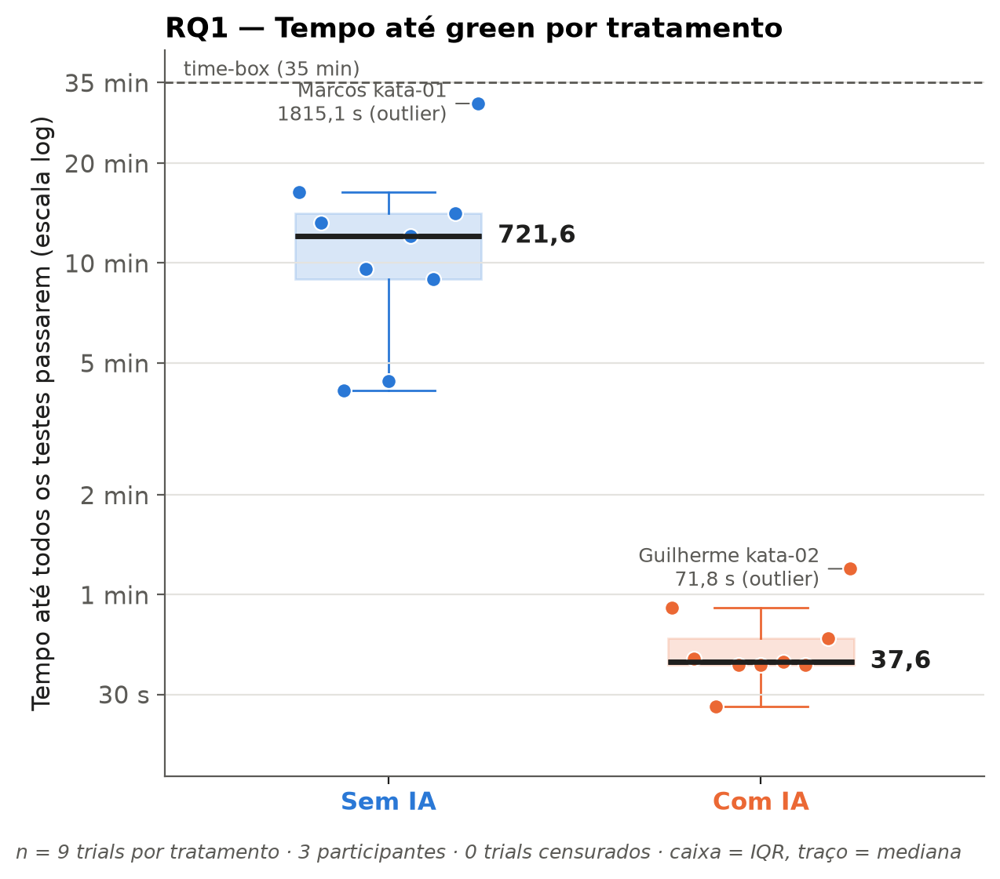

*Figura 1 — Tempo até todos os testes passarem, por tratamento (9 trials cada). A caixa marca o IQR e o traço a mediana (37,6 s e 721,6 s). Cada ponto é um trial. O eixo é logarítmico, com marcas em segundos e minutos, porque os tempos dos dois tratamentos diferem em uma a duas ordens de grandeza. A linha tracejada marca o time-box de 35 min (nenhum trial foi censurado). Os dois outliers de Tukey estão rotulados e foram mantidos.*

**Tabela 2 — Tempo por participante (unidade do teste pareado)**

| Participante | Com IA: mín / mediana / máx (s) | Sem IA: mín / mediana / máx (s) | Diferença das medianas (s) | Com IA / sem IA |
|---|---:|---:|---:|---:|
| Guilherme | 37,6 / 44,3 / 71,8 | 263,7 / 537,4 / 574,3 | −493,1 | 8,2% |
| Arthur | 27,6 / 38,4 / 54,7 | 246,9 / 721,6 / 794,4 | −683,2 | 5,3% |
| Marcos | 36,8 / 36,8 / 36,8 | 848,7 / 982,1 / 1815,1 | −945,3 | 3,7% |

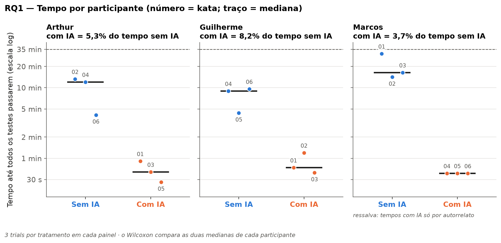

*Figura 2 — Os 6 trials de cada participante: 3 sem IA e 3 com IA, com o número do kata sobre cada ponto e a mediana de cada lado. É a comparação que o Wilcoxon faz (a mediana sem IA contra a mediana com IA de cada participante, N = 3). O subtítulo do painel de Marcos indica que seus tempos com IA são só autorrelato. Os números de kata também mostram o confundimento: cada lado contém katas diferentes.*

**Tamanho de efeito:** a diferença entre as medianas gerais é **−684,0 s**. Por participante, a diferença das medianas vai de −493,1 s a −945,3 s (Tabela 2).

**Teste de hipótese:** Wilcoxon pareado por participante, exato, n = 3 pares: **W = 0,0; p unilateral = 0,125** (p bilateral = 0,250). **H0 não rejeitada** a α = 0,05.

**Outliers:** Guilherme no kata-02 com IA (71,8 s; cerca superior 55,6 s) e Marcos no kata-01 sem IA (1815,1 s; cerca superior 1315,6 s). Os dois foram mantidos. Como o teste usa a mediana de cada participante, nenhum deles muda o par.

**Discussão hipótese vs. resultado.**

- **Evidência descritiva:** os tempos observados foram muito menores no tratamento com IA. A mediana com IA (37,6 s) é cerca de **5%** da mediana sem IA (721,6 s). Houve **separação completa**: o tempo com IA mais lento (71,8 s) ficou abaixo do tempo sem IA mais rápido (246,9 s). A diferença tem a mesma direção nos três participantes, e a mediana com IA de cada um ficou entre 3,7% e 8,2% da sua mediana sem IA.
- **Inferência:** com p unilateral = 0,125, N = 3 pares e α = 0,05, **não foi possível rejeitar H0**. O valor de 0,125 é o menor que o teste pode produzir com 3 pares, então o teste não tem resolução para rejeitar H0 nesta amostra. A conclusão é "H0 não rejeitada", e não "a IA não reduz o tempo". A evidência descritiva aponta na direção de H1, mas não é confirmatória.

Ressalvas que limitam a leitura:

1. **Confundimento de ordem e kata:** para Guilherme e Marcos, que executaram os tratamentos em blocos, tratamento e bloco de katas andam juntos. A ordem cronológica não está registrada nos dados; se ela seguiu a numeração dos katas, tratamento e ordem de execução também estão confundidos.
2. **Resolução do cronômetro:** no modo `--kata-path`, o cronômetro verifica o *green* a cada 5 s, uma resolução próxima da escala dos tempos com IA (28–72 s). O modo usado em cada trial não foi registrado.
3. **Tempos de Marcos com IA:** são confirmados apenas por autorrelato.

### 4.3 RQ2 — Defeitos (testes de aceitação falhando)

> **H0:** o uso de assistente de IA não reduz a quantidade de defeitos (testes que falham) no código produzido. **H1:** reduz.

**Tabela 3 — Defeitos por tratamento**

| Tratamento | n | Taxa de sucesso — mediana (IQR) | Mín – Máx | Testes falhando — mediana (IQR) | Mín – Máx |
|---|---:|---:|---:|---:|---:|
| Com IA | 9 | 100,0% (0,0) | 100,0 – 100,0 | 0 (0) | 0 – 0 |
| Sem IA | 9 | 100,0% (0,0) | 100,0 – 100,0 | 0 (0) | 0 – 0 |

Por participante, a média da taxa de sucesso foi de 100% e a média de testes falhando foi de 0 nos dois tratamentos, para os três participantes.

**Teste de hipótese:** Wilcoxon pareado por participante (n = 3) **não aplicável** às duas métricas. Todas as diferenças pareadas são exatamente zero, então não há p-valor a reportar e nenhuma correção de multiplicidade se aplica. H0 não é rejeitada, mas não por um resultado do teste: não houve diferença a testar.

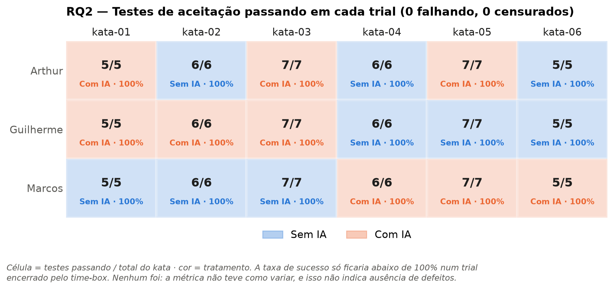

*Figura 3 — Como os 18 trials terminaram: 9 de 9 no green em cada tratamento, e nenhum no time-box (censurado). A figura mostra o mecanismo que impede a RQ2 de ser respondida: a taxa de sucesso só poderia ficar abaixo de 100% num trial encerrado pelo time-box. Ela não mede defeitos e não indica ausência de defeitos. Os valores da métrica estão na Tabela 3.*

**Discussão hipótese vs. resultado.** Os 18 trials terminaram com todos os testes passando, então a RQ2 **não tem variância a comparar**. Isso não é evidência de que os tratamentos produzam a mesma quantidade de defeitos: decorre da forma como o protocolo mede defeitos (**efeito de teto**, uma questão de validade de construto). O trial termina no *green*, isto é, quando todos os testes passam, e por isso uma taxa de sucesso abaixo de 100% só poderia aparecer em um trial censurado. Nenhum trial foi censurado, e com isso a métrica não teve como variar. A RQ2 depende, portanto, da censura da RQ1. Com a métrica coletada, **a RQ2 não pôde ser respondida**. Os dados só permitem dizer que, sob os dois tratamentos, todos os participantes chegaram a uma solução que passa nos testes de aceitação dentro do time-box. Isso não mostra que "não houve defeitos": defeitos fora da cobertura dos testes de aceitação não são medidos.

### 4.4 RQ3 — Estrutura do código

> **H0:** o uso de assistente de IA não altera a complexidade ciclomática nem a duplicação do código produzido. **H1:** altera a complexidade ciclomática e/ou a duplicação.

As métricas foram coletadas na S02 com Radon 6.0.1 (CC, MI e LOC) e jscpd 4.0.5 (duplicação), uma observação por trial. Cada `solution.py` tem exatamente uma função, então a CC média do trial é a CC dessa função. **LOC** é o `loc` bruto do Radon, com linhas em branco e comentários, e é reportada como métrica de controle junto de CC e duplicação, como exige o enunciado.

**Tabela 4 — Métricas estáticas por tratamento e teste pareado por participante (bilateral)**

| Métrica | Sem IA — mediana (IQR) | Com IA — mediana (IQR) | Diferença | W | p | r_rb |
|---|---:|---:|---:|---:|---:|---:|
| LOC (linhas) | 21,0 (14,0) | 14,0 (4,0) | −7,0 | 0,0 | 0,25 | −1,00 |
| CC (complexidade ciclomática) | 8,00 (4,00) | 5,00 (2,00) | −3,00 | 0,0 | 0,25 | −1,00 |
| CC/LOC (complexidade por linha) | 0,282 (0,167) | 0,444 (0,115) | +0,162 | 0,0 | 0,25 | +1,00 |
| MI como coletado (0–100) ¹ | 77,93 (14,70) | 80,71 (13,95) | +2,78 | 0,0 | 0,25 | +1,00 |
| MI harmonizado (0–100) — sensibilidade ¹ | 58,85 (5,57) | 63,75 (3,68) | +4,90 | 0,0 | 0,25 | +1,00 |
| Duplicação (% de linhas) | 0,00 (0,00) | 0,00 (0,00) | 0,00 | — | não aplicável | — |

*Diferença = mediana com IA − mediana sem IA, sobre os 9 trials de cada tratamento. W, p e r_rb vêm do Wilcoxon pareado por participante (N = 3 pares). r_rb é a correlação bisserial de postos pareada: com 3 pares, ±1,00 significa apenas que os três pares foram na mesma direção. Na CC, as diferenças pareadas (Arthur −3, Guilherme −2, Marcos −2) têm empates em módulo, e o p "exato" é aproximado nesse caso; como os três sinais são iguais, o valor 0,25 não se altera. ¹ As duas linhas de MI usam convenções de cálculo diferentes; ver "Índice de manutenibilidade" abaixo.*

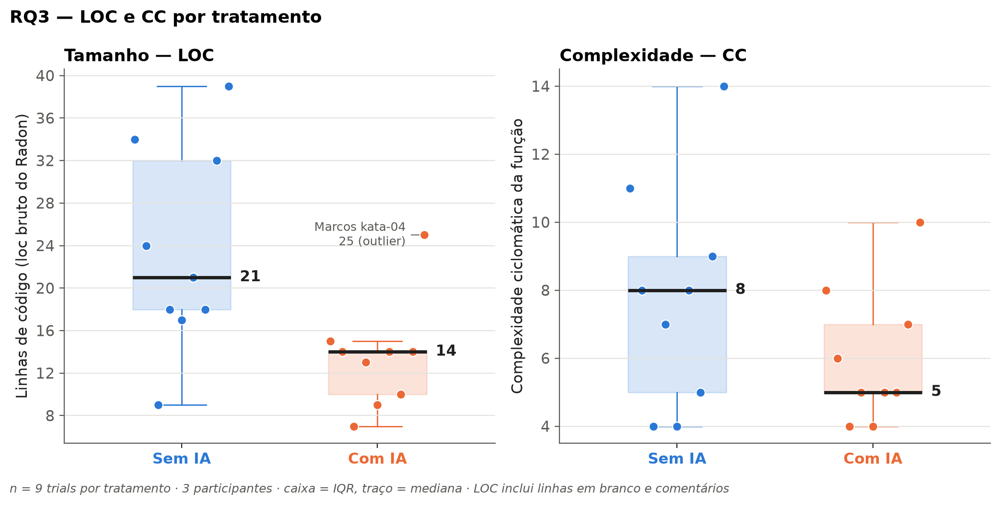

*Figura 4 — Tamanho (LOC) e complexidade ciclomática (CC) por tratamento, com um painel por métrica. A caixa marca o IQR, o traço a mediana (LOC 21 × 14; CC 8 × 5), e cada ponto é um trial. O outlier de LOC (Marcos kata-04 com IA, 25 linhas) está rotulado e foi mantido. A LOC é o `loc` bruto do Radon.*

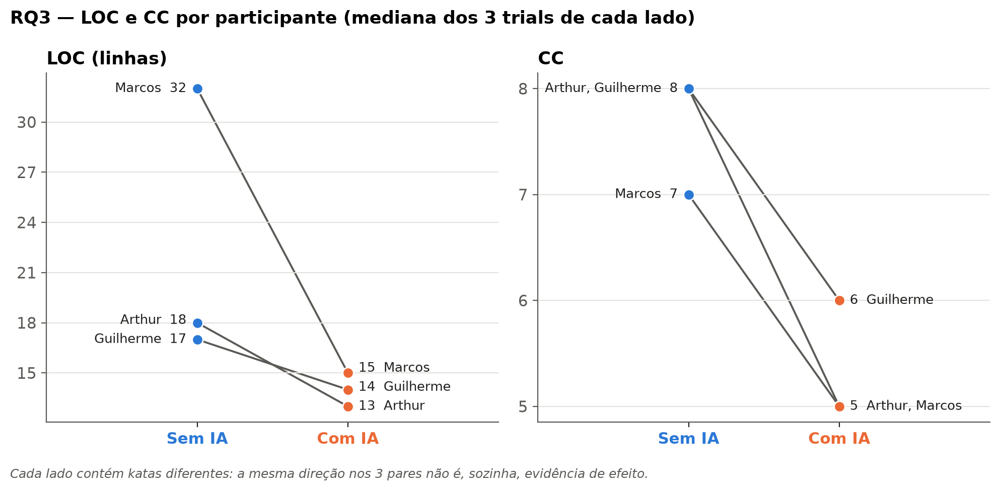

*Figura 5 — A comparação que o Wilcoxon faz (N = 3): uma linha por participante, da mediana sem IA à mediana com IA. Os três pares vão na mesma direção em LOC e em CC, mas cada lado contém katas diferentes. Essa unanimidade, sozinha, não é evidência de efeito (ver "Confundimento" abaixo).*

**Índice de manutenibilidade: duas séries.** O MI aparece em duas séries, que **não devem ser comparadas em nível absoluto**:

- **MI como coletado** — o resultado principal, gravado em `data/static_metrics.csv` na S02 e mantido sem alteração. O coletor grava a média do MI por arquivo `.py` do diretório do trial. Quando os 12 trials de Arthur e Marcos foram medidos, o diretório já continha um `__init__.py` vazio, que pontua MI = 100. Esses 12 valores são, portanto, a média entre o `solution.py` e esse arquivo vazio. Os 6 valores de Guilherme foram medidos antes de o arquivo existir e correspondem ao `solution.py` sozinho. O coletor atual não reproduz esses 6 valores. A série mistura as duas convenções, e por isso a mediana por tratamento (77,93 / 80,71) não é comparável entre participantes. No pareamento por participante, os dois lados de cada par usam a mesma convenção, e o sinal de cada diferença é preservado. **Esta série é a da Tabela 4 (linha "MI como coletado") e do painel esquerdo da Figura 6.**
- **MI harmonizado** — a análise de sensibilidade: o MI do `solution.py` sozinho, recalculado para os 18 trials a partir do código versionado (coluna `mi_source_only` de [`source_integrity_check.csv`](../results/rq3/source_integrity_check.csv)). É uma convenção única para todos. Os 12 valores de Arthur e Marcos ficam entre 15,5 e 23,6 pontos abaixo da série como coletada; os 6 de Guilherme são iguais nas duas séries. **É o painel direito da Figura 6.**

**Interpretação:** as duas séries apontam na mesma direção nos três pares (MI maior com IA, r_rb = +1,00, p = 0,25). A diferença de nível entre elas vem da convenção de cálculo, não dos dados. Detalhes em [`data_quality_report.md`](../results/rq3/data_quality_report.md).

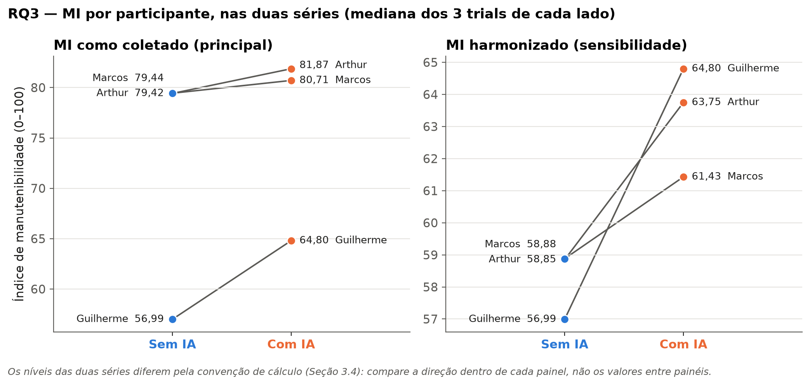

*Figura 6 — MI por participante (mediana dos 3 trials de cada lado), nas duas séries: como coletado (principal, à esquerda) e harmonizado (sensibilidade, à direita). Nas duas, o MI foi maior com IA nos três participantes. Os níveis diferem entre os painéis pela convenção de cálculo; no painel da esquerda, o nível mais baixo de Guilherme vem dessa convenção. No painel da direita, os pontos sem IA de Arthur (58,85) e Marcos (58,88) quase coincidem. Por isso o MI é mostrado pareado, e não como distribuição conjunta dos 18 trials.*

**Normalização por LOC.** CC e LOC têm correlação moderada nos 18 trials (Spearman ρ = 0,63). Por isso foi calculada a razão CC/LOC, para separar "mais complexo porque é maior" de "mais complexo por linha". A CC/LOC é uma **métrica derivada** das duas anteriores, e não uma terceira evidência independente. Ela é sensível à definição de LOC: o `loc` bruto do Radon conta linhas em branco e comentários. Com as linhas de código-fonte sem essas linhas (SLOC, coluna `sloc_recomputed` de `source_integrity_check.csv`), as medianas de CC/SLOC ficam em 0,429 (sem IA) e 0,500 (com IA). A diferença cai de 0,162 para 0,071, menos da metade. O MI não foi normalizado, porque já incorpora linhas de código na fórmula. A duplicação/LOC é zero por construção.

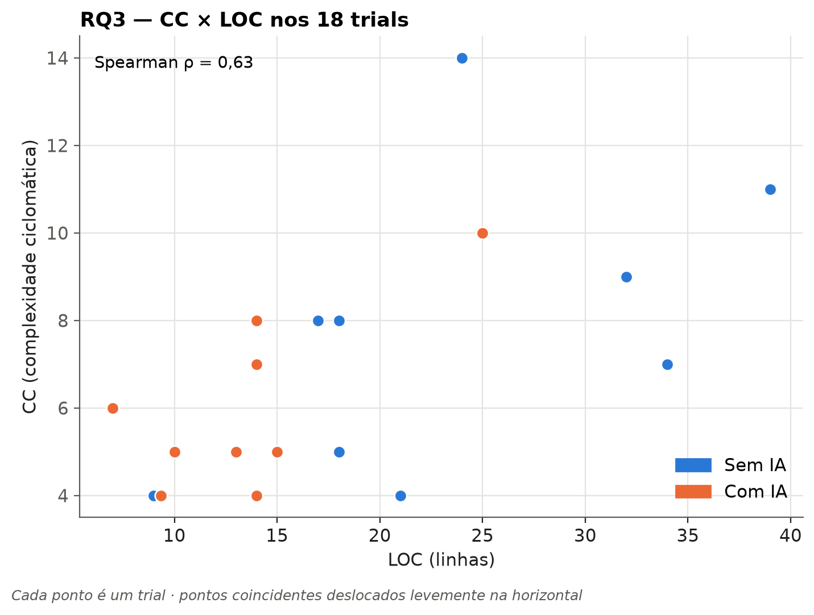

*Figura 7 — CC contra LOC nos 18 trials (Spearman ρ = 0,63). A complexidade tende a acompanhar o tamanho, e os trials com IA ficam na região de menos linhas. É uma associação entre trials, não um efeito do tratamento.*

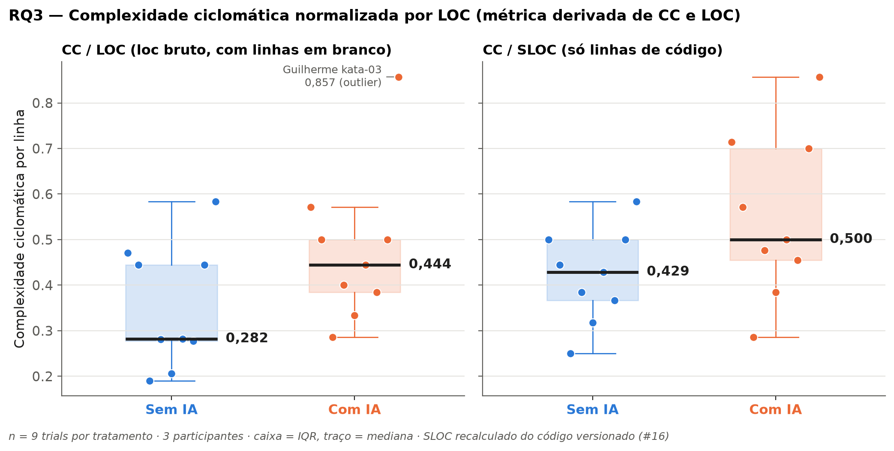

*Figura 8 — Complexidade ciclomática normalizada por LOC, uma métrica derivada de CC e LOC, com duas definições de linha. À esquerda, CC/LOC com o `loc` bruto (medianas 0,282 × 0,444); à direita, CC/SLOC, só com linhas de código (0,429 × 0,500). A diferença entre os tratamentos cai de 0,162 para 0,071 quando as linhas em branco e os comentários saem do denominador. O outlier (Guilherme kata-03 com IA, 0,857) está rotulado e foi mantido.*

**Outliers (Tukey, por tratamento):** LOC de Marcos no kata-04 com IA (25 linhas; cerca superior 20) e CC/LOC de Guilherme no kata-03 com IA (0,857; cerca superior 0,673). Os dois foram sinalizados e mantidos (ver [`outliers.csv`](../results/rq3/outliers.csv)).

**Multiplicidade.** A RQ3 fez 14 testes. Os 4 de duplicação e duplicação/LOC são degenerados (sem p-valor), e os outros 10 produziram p-valor. Cada **família** de correção é uma unidade de pareamento, com 5 testes cada (LOC, CC, MI como coletado, MI harmonizado e CC/LOC):

- **Participante** (análise primária): todos os p brutos = 0,25; Bonferroni = 1; BH = 0,25.
- **Kata** (sensibilidade): p brutos de 0,03125 a 0,84375; ver abaixo.

Os p-valores brutos foram mantidos e reportados ao lado dos p ajustados por Bonferroni (erro por família) e Benjamini–Hochberg (taxa de falsas descobertas). **Nenhum teste permanece significativo após a correção.** Nenhum p bruto atingiria o limiar de Bonferroni mesmo com os 10 testes numa única família (α = 0,005). Valores completos em [`statistical_tests.csv`](../results/rq3/statistical_tests.csv).

**Análise de sensibilidade: pareamento por kata (N = 6).** Parear por kata bloqueia a dificuldade da tarefa e baixa o piso de p para 0,031, mas os dois lados de cada par vêm de participantes diferentes. Resultados (p bruto): LOC 0,0625; CC 0,375; MI como coletado 0,844; CC/LOC 0,3125; MI harmonizado 0,03125. O MI harmonizado é o **único p bruto abaixo de α**. O caminho completo desse resultado:

1. **Resultado bruto:** p = 0,03125, com os 6 katas na mesma direção.
2. **Contexto:** 0,03125 = 2/2⁶ é o **menor p bilateral exato possível** com 6 pares. O valor observado é o piso do teste, não um valor que se destaque dentro do intervalo possível.
3. **Correção de multiplicidade:** na família de 5 testes do pareamento por kata, p ajustado = 0,156 por Bonferroni e 0,156 por Benjamini–Hochberg, acima de α. Como o p bruto já está no piso, nenhuma correção com mais de um teste poderia mantê-lo abaixo de 0,05.
4. **Interpretação final:** não significativo. O resultado ainda vem de uma análise secundária, que não é within-subject, e usa o MI harmonizado, não a série como coletada. Ele é mantido visível, mas não altera a conclusão.

**Confundimento entre tratamento e dificuldade do kata.** Como cada lado do par contém katas diferentes, a dificuldade das tarefas entra junto na diferença medida, e a distribuição dos katas entre os tratamentos não ficou equilibrada. A dificuldade de cada kata foi estimada pela sua CC média entre os três participantes ([`task_allocation_balance.csv`](../results/rq3/task_allocation_balance.csv)):

| Participante | Katas com IA | Katas sem IA | Diferença de CC média dos katas (com IA − sem IA) |
|---|---|---|---:|
| Arthur | kata-01, kata-03, kata-05 | kata-02, kata-04, kata-06 | −3,56 |
| Guilherme | kata-01, kata-02, kata-03 | kata-04, kata-05, kata-06 | −0,89 |
| Marcos | kata-04, kata-05, kata-06 | kata-01, kata-02, kata-03 | +0,89 |

- Em **2 dos 3 participantes** (Arthur e Guilherme), os katas do lado com IA eram, em média, menos complexos segundo a CC. Para Marcos, o desequilíbrio vai no sentido oposto.
- Em LOC, Guilherme e Marcos ficam praticamente equilibrados (±0,11).
- O kata-04, o de maior CC média, ficou no lado sem IA para Arthur e Guilherme.

Esse indicador é derivado das próprias medições e absorve parte de um eventual efeito do tratamento. Ele serve para descrever a alocação, não para estimar um efeito de tarefa. Há, portanto, **confundimento entre tarefa (kata) e tratamento**, uma limitação do desenho executado (seção 3.3.1) que a análise não corrige. Parte das diferenças observadas pode estar associada à composição dos katas de cada lado. Em particular, o fato de os três pares apontarem na mesma direção em LOC e em CC **não pode ser interpretado isoladamente como evidência do efeito do tratamento**.

**Discussão hipótese vs. resultado.**

- **Evidência descritiva:** o código produzido com IA foi **menor** (mediana de 14 contra 21 linhas), teve **CC absoluta menor** (5 contra 8) e teve **MI maior** nas duas séries de MI. As três direções se repetem nos três participantes. Nesta amostra, o código com IA não foi mais verboso. Com 3 pares e o confundimento com os katas, porém, isso não basta para descartar a preocupação do enunciado de que o código gerado por IA seja mais verboso.
- **CC, LOC e CC/LOC:** não são três evidências independentes. Como o LOC caiu proporcionalmente mais que a CC, a razão CC/LOC ficou maior com IA (0,444 contra 0,282). A diferença cai para menos da metade (0,071) quando as linhas em branco não são contadas. A CC absoluta menor acompanha, em boa parte, o tamanho menor, e não indica um código com lógica mais simples por linha.
- **Inferência:** nenhuma dessas diferenças é estatisticamente significativa. Com 3 pares o p bilateral mínimo é 0,25, nenhum teste sobrevive à correção de multiplicidade, e o confundimento com a dificuldade dos katas impede atribuir a direção observada só ao tratamento.
- **Duplicação:** nenhum bloco duplicado foi detectado em nenhum dos 18 trials. Isso é um valor observado, não prova de que o código não tenha duplicação. Cada trial tem uma única função num único arquivo, e o jscpd exige 5 linhas / 20 tokens repetidos dentro do próprio trial. Nesse arranjo, a métrica não teve oportunidade de variar, e a duplicação **não pôde ser avaliada adequadamente**. Por isso não há figura de duplicação: um gráfico de valor constante sugeriria uma evidência que a coleta não produziu.

**Conclusão da RQ3: H0 não rejeitada.** Os dados não permitem afirmar que o uso de IA alterou a complexidade ciclomática, e a duplicação não foi avaliável com a métrica coletada.

### 4.5 Síntese frente às hipóteses

| RQ | Métrica principal | Com IA × sem IA (medianas) | Teste (pareado por participante, n = 3) | Decisão (α = 0,05) | O que os dados respondem |
|---|---|---|---|---|---|
| RQ1 | Tempo até *green* | 37,6 s × 721,6 s | W = 0,0; p unilateral = 0,125 (piso) | H0 não rejeitada | Descritivamente, tempos muito menores com IA nos três participantes, com separação completa; o teste não tem resolução para confirmar a diferença |
| RQ2 | Taxa de sucesso / testes falhando | 100% × 100% / 0 × 0 | Não aplicável (diferenças nulas) | Teste não aplicável; H0 não rejeitada | **Não respondida:** sem variação, por efeito de teto do protocolo de encerramento |
| RQ3 | CC (LOC como controle; CC/LOC derivada; MI como aprofundamento) | CC 5 × 8; LOC 14 × 21; CC/LOC 0,444 × 0,282; MI maior com IA nas duas séries | W = 0,0; p bilateral = 0,25 (piso); nenhum teste significativo após correção | H0 não rejeitada | Descritivamente, código com IA menor, com CC absoluta menor e mais denso por linha; sem significância e com confundimento de kata |
| RQ3 | Duplicação | 0% × 0% | Não aplicável (diferenças nulas) | Teste não aplicável; H0 não rejeitada | **Não avaliável** com a métrica coletada: nenhuma duplicação detectada, e a métrica não teve como variar |

Em nenhuma RQ foi possível rejeitar H0. Nas três, porém, isso reflete limitações do desenho executado, e não evidência de equivalência entre os tratamentos: 3 pares, com piso de p acima de α; efeito de teto na RQ2; ausência de variância na duplicação; e confundimento entre tratamento e kata. Essas limitações são discutidas na seção 5.

### 4.6 Análise exploratória: MI em profundidade e nº de prompts (bônus, Issue #18)

Esta análise é **exploratória e descritiva**. Ela não acrescenta testes de hipótese, porque os testes de MI entre tratamentos já estão na seção 4.4, com correção de multiplicidade.

**MI em profundidade.** O Radon calcula o MI a partir de quatro componentes: volume de Halstead (V), complexidade ciclomática (G), linhas lógicas (LLOC, L) e % de linhas de comentário (C). Os componentes foram recalculados do `solution.py` de cada trial, na convenção do MI harmonizado. O MI reconstruído a partir deles confere com essa série nos 18 trials.

| Componente | Sem IA — mediana (IQR) | Com IA — mediana (IQR) | ρ de Spearman com o MI (18 trials) |
|---|---:|---:|---:|
| LLOC (L) | 17 (6) | 12 (5) | −0,91 |
| CC (G) | 8 (4) | 5 (2) | −0,85 |
| Volume de Halstead (V) | 82,04 (42,12) | 62,91 (33,79) | −0,63 |
| Comentários (C) | 0% (0) | 0% (0) | — (constante) |

- Nenhum trial tem comentários, então o termo C da fórmula é constante e não explica nenhuma diferença de MI.
- Nesta amostra, o MI acompanha sobretudo o tamanho lógico e a CC, e parte dessa associação é mecânica, porque esses componentes estão na própria fórmula.
- O MI maior com IA observado na seção 4.4 corresponde, portanto, ao código com IA ter menos linhas lógicas e menor CC. Como métrica composta, o MI **não acrescenta aqui evidência independente** de LOC e CC, e herda deles o confundimento com os katas.

**Nº de prompts × qualidade do código.** O nº de prompts vem de `data/prompts/prompt_records.csv` (autorrelato; seção 3.3.4), que cobre os 9 trials com IA. O MI usado é o harmonizado, porque a comparação é entre participantes e o MI como coletado não é comparável entre participantes.

| Participante | Nº de prompts | CC (mediana) | MI harmonizado (mediana) | LOC (mediana) |
|---|---:|---:|---:|---:|
| Arthur | 1 | 5 | 63,75 | 13 |
| Guilherme | 1 | 6 | 64,80 | 14 |
| Marcos | 2 | 5 | 61,43 | 15 |

Nos 9 trials com IA, o ρ de Spearman entre o nº de prompts e cada métrica foi −0,05 (CC), −0,18 (MI harmonizado) e 0,37 (LOC). São valores apenas descritivos, sem p-valor, por três motivos:

- O nº de prompts teve só dois valores: 1 para Arthur e Guilherme, 2 para Marcos.
- Ele é **constante dentro de cada participante**, então qualquer associação se confunde com o participante e, como cada um resolveu katas diferentes com IA, também com o kata.
- Os 9 trials não são independentes, porque são 3 por participante.

**Os dados coletados não permitem avaliar se o nº de prompts está associado à qualidade do código.**

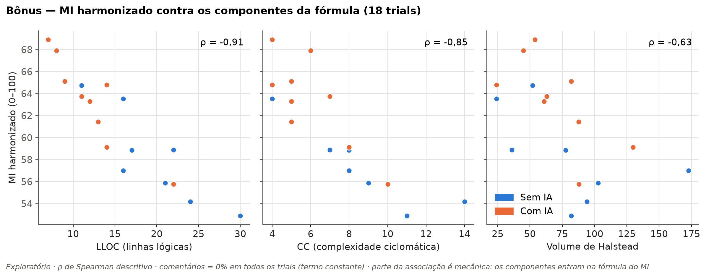

*Figura 9 — MI harmonizado contra LLOC, CC e volume de Halstead, nos 18 trials, com o ρ de Spearman descritivo em cada painel. Os pontos com IA ficam na região de menos linhas e menor CC, e por isso com MI mais alto. Arthur kata-06 (sem IA) e Marcos kata-06 (com IA) têm valores idênticos nos três componentes; os dois pontos foram deslocados levemente na horizontal para ficarem visíveis.*

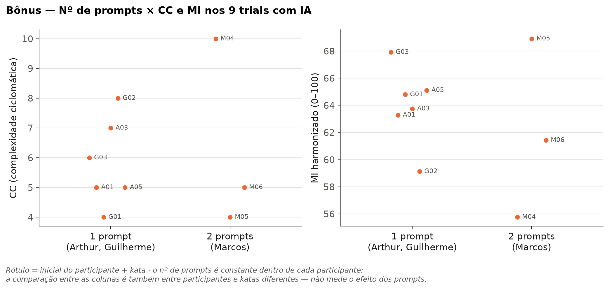

*Figura 10 — CC e MI harmonizado dos 9 trials com IA, agrupados pelo nº de prompts. O rótulo de cada ponto é a inicial do participante mais o kata. O eixo mostra quem está em cada coluna: a comparação entre colunas também é entre participantes e katas diferentes, e não mede o efeito dos prompts.*

---

## 5. Discussão

### 5.1 Interpretação integrada dos resultados

Nas três RQs, o tratamento com IA esteve associado a tempos de resolução muito menores e a código mais compacto e com menor complexidade ciclomática absoluta; as taxas de sucesso foram idênticas (100%) nos dois tratamentos, por construção do protocolo. Em nenhuma RQ foi possível rejeitar H0 estatisticamente. Essa combinação — efeito descritivo grande, inferência não significativa — não é contraditória: decorre de limitações do desenho executado, discutidas a seguir.

**RQ1 — Tempo.** A separação completa entre os tratamentos (o trial com IA mais lento foi mais rápido que o trial sem IA mais rápido) é o resultado descritivo mais robusto do estudo. A diferença de medianas foi de −684 s, e a mesma direção se repetiu nos três participantes. O p unilateral de 0,125 é o menor valor que o Wilcoxon pareado pode produzir com 3 pares: o teste não tem resolução para confirmar a diferença nesta amostra, o que não significa que a diferença seja pequena. A direção observada é coerente com a literatura: Copilot e assistentes similares têm sido associados a reduções de tempo da ordem de 50–56% em tarefas de programação controladas (PENG et al., 2023; GITHUB, 2022). No presente estudo, a mediana com IA foi cerca de 95% menor que a sem IA, mas katas curtos com solução única são mais suscetíveis a esse efeito do que tarefas de produção.

**RQ2 — Defeitos.** A ausência de variação na taxa de sucesso não é um resultado sobre os tratamentos: é uma consequência direta do protocolo de encerramento. O trial termina no *green*, isto é, quando todos os testes passam — e, como nenhum trial foi censurado, todos os 18 terminaram com 100% de sucesso. A RQ2 não foi respondida. Para respondê-la seria necessário registrar o estado do código num momento que não dependa do *green* (por exemplo, no encerramento pelo time-box), o que exigiria uma modificação no protocolo.

**RQ3 — Estrutura do código.** Os três indicadores descritivos (LOC menor, CC absoluta menor, MI maior com IA) repetiram-se nos três participantes. O resultado mais delicado é a CC/LOC: embora o código com IA tenha sido menor e menos complexo em termos absolutos, a razão CC por linha foi maior (0,444 contra 0,282 com LOC bruto; 0,500 contra 0,429 com SLOC). Isso sugere que o assistente produziu código mais denso — mais lógica por linha — e não necessariamente mais simples. A interpretação é inconclusiva, contudo, porque o confundimento entre tratamento e kata (cada participante resolveu katas diferentes em cada tratamento) impede isolar o efeito do assistente do efeito da dificuldade da tarefa. A duplicação zero em todos os trials decorre da estrutura da coleta (uma função por arquivo, limiares de 5 linhas e 20 tokens), e não de uma característica demonstrada do código produzido.

### 5.2 Ameaças à validade observadas na execução

As ameaças previstas no desenho (seção 3.3.5) se concretizaram em graus distintos durante a execução:

**Efeito de aprendizado** *(validade interna).* O contrabalanceamento entre participantes foi aplicado: Guilherme fez os katas 1–3 com IA e 4–6 sem IA; Arthur alternou (katas 1, 3, 5 com IA; 2, 4, 6 sem IA); Marcos fez os katas 1–3 sem IA e 4–6 com IA. Como a ordem cronológica real de execução não ficou registrada nos dados, não é possível garantir que os efeitos de aprendizado foram distribuídos igualmente.

**Memorização pelo assistente de IA** *(validade interna).* Os katas foram elaborados de forma autoral, sem publicação prévia. O risco de memorização foi reduzido, mas não eliminado: o assistente pode ter generalizado padrões de katas similares vistos no treinamento. Essa ameaça não pode ser avaliada com os dados disponíveis.

**Familiaridade prévia com o assistente de IA** *(validade interna).* Os três declararam uso de assistentes de IA em estágio profissional, todos com familiaridade "Intermediária" (autorrelato; seção 3.3.2). Como o nível declarado é o mesmo para os três, a familiaridade não explica as diferenças entre participantes na redução relativa de tempo (mediana com IA de 3,7% da mediana sem IA para Marcos, 5,3% para Arthur e 8,2% para Guilherme; Tabela 2). Com uma escala autorrelatada e grosseira, porém, diferenças reais de familiaridade dentro do mesmo nível não podem ser descartadas. A ameaça fica registrada e não é controlada.

**Tamanho amostral reduzido** *(conclusão estatística).* Com 3 participantes, o piso de p do Wilcoxon pareado é 0,125 unilateral e 0,25 bilateral — acima de α = 0,05. Nenhuma diferença, por maior que seja, pode produzir um resultado significativo neste experimento. Não é uma limitação contornável por escolha de teste: é uma restrição estrutural do desenho.

**Qualidade e proveniência dos dados** *(ameaça não prevista no desenho).* Os tempos com IA de Marcos são confirmados apenas por autorrelato, e o modo do cronômetro usado (ENTER ou verificação automática) não foi registrado para nenhum trial. Essa ameaça atinge a variável dependente principal (RQ1).

**Confundimento tratamento–kata** *(ameaça não prevista no desenho).* Como o protocolo executado não atribuiu o mesmo kata aos dois tratamentos para nenhum participante, a dificuldade da tarefa entra como variável de confusão em todas as comparações. Em 2 dos 3 participantes (Arthur e Guilherme), os katas do lado com IA tinham, em média, CC menor — o que pode explicar parte da diferença observada em CC e LOC.

### 5.3 Relação com a literatura e limitações de generalização

Os resultados descritivos da RQ1 são coerentes com estudos que reportam ganhos de produtividade com assistentes de IA em tarefas de programação controladas. Peng et al. (2023) reportaram 55,8% de redução no tempo de conclusão de uma tarefa de implementação de servidor HTTP com GitHub Copilot. O efeito observado neste estudo foi proporcionalmente maior, o que pode refletir a natureza dos katas — tarefas curtas, com solução única e testes de aceitação claros, em que o assistente pode gerar a solução quase diretamente a partir do enunciado.

A generalização é limitada por três fatores: (1) os participantes são estudantes de graduação em ambiente acadêmico controlado, não profissionais em contexto de produção; (2) os katas são tarefas de complexidade reduzida, com domínio bem delimitado, diferentemente de tarefas de manutenção ou de desenvolvimento de novas funcionalidades em bases de código existentes; (3) o assistente utilizado (Claude Sonnet 5, via Claude Code) pode ter comportamento diferente de outros assistentes, e os resultados não devem ser generalizados para ferramentas distintas.

---

## 6. Conclusão

Este laboratório investigou o impacto do uso de um assistente de IA generativa (Claude Sonnet 5 via Claude Code) na resolução de katas de programação em Python, por meio de um experimento controlado *crossover within-subject* com três participantes, seis katas autorais e 18 trials.

**Em nenhuma das três RQs foi possível rejeitar H0** com α = 0,05. Esse resultado deve ser lido com cautela: ele não é evidência de que o assistente de IA não tem efeito. Ele reflete, sobretudo, as limitações do desenho executado — em especial o tamanho amostral de 3 participantes, que impede qualquer teste pareado de atingir significância estatística, e o confundimento entre tratamento e kata decorrente do desvio de protocolo.

**Descritivamente**, os dados são expressivos:

- **RQ1:** com IA, o tempo mediano de resolução foi de 37,6 s, contra 721,6 s sem IA — cerca de 19 vezes menor —, com separação completa entre os tratamentos.
- **RQ2:** a taxa de sucesso foi de 100% nos dois tratamentos, o que impediu a avaliação da RQ2 por efeito de teto do protocolo.
- **RQ3:** com IA, o código produzido foi mais compacto (mediana de 14 contra 21 linhas) e teve menor complexidade ciclomática absoluta (5 contra 8), embora mais denso por linha (CC/LOC 0,444 contra 0,282). Nenhuma duplicação foi detectada em nenhum dos 18 trials, o que impediu a avaliação desse aspecto da RQ3 com a métrica coletada.

**Para estudos futuros**, as principais recomendações são:

1. aumentar o número de participantes para pelo menos 8–10, de modo a dar ao teste estatístico resolução suficiente;
2. registrar o estado do código num momento independente do *green*, separando *green* de censura, para viabilizar a RQ2;
3. balancear a alocação kata × tratamento entre os participantes (por exemplo, com um quadrado latino), de modo que cada kata apareça o mesmo número de vezes em cada tratamento, e calibrar a dificuldade dos katas com um piloto — repetir o mesmo kata para o mesmo participante nos dois tratamentos não resolveria o confundimento, porque introduziria memorização da própria solução;
4. registrar todos os tempos com o cronômetro padronizado, no modo de verificação automática, com horário de início;
5. registrar prompts e familiaridade com IA por cada participante, no momento do trial.

Apesar das limitações, o experimento cumpriu seu propósito formativo: exercitou a definição de hipóteses, o planejamento experimental, a coleta de dados com instrumentação (seção 3.3.4), a análise estatística não paramétrica e a discussão crítica de ameaças à validade em um contexto real de experimentação em Engenharia de Software.

---

## 7. Referências

BASILI, V. R.; CALDIERA, G.; ROMBACH, H. D. **The Goal Question Metric Approach**. Encyclopedia of Software Engineering. Wiley, 1994.

BATELLA, C. et al. **Análise de Dados Aplicada à Experimentação em Engenharia de Software**: Trabalho Final — Grupo 1. Pontifícia Universidade Católica de Minas Gerais, Engenharia de Software, jun. 2026. 98 slides.

CONOVER, W. J. **Practical Nonparametric Statistics**. 3. ed. Wiley, 1999.

GITHUB. **Research: quantifying GitHub Copilot's impact on developer productivity and happiness**. GitHub Blog, 2022. Disponível em: https://github.blog/2022-09-07-research-quantifying-github-copilots-impact-on-developer-productivity-and-happiness/.

PENG, S. et al. **The Impact of AI on Developer Productivity: Evidence from GitHub Copilot**. arXiv preprint arXiv:2302.06590, 2023.

WOHLIN, C. et al. **Experimentation in Software Engineering**. Springer, 2012.
