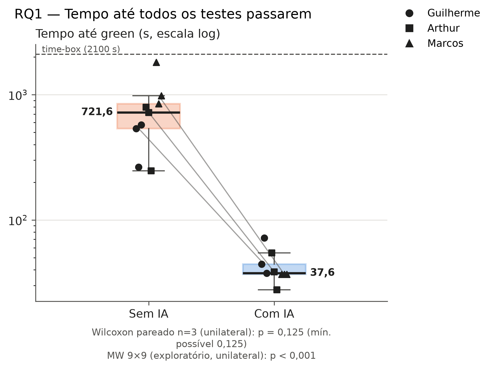
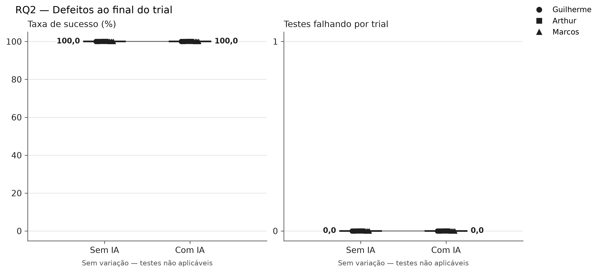
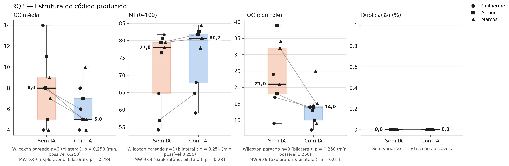

<h1 align="center">Relatório de Laboratório</h1>

| | |
|---|---|
| **Curso** | Engenharia de Software |
| **Disciplina** | Laboratório de Experimentação de Software |
| **Turno / Período** | Noite / 6º |
| **Professor(a)** | Danilo Maia |
| **Laboratório** | Lab02 — Impacto do Uso de Assistentes de IA na Resolução de Katas de Programação |
| **Grupo (trio)** | Arthur Luiz Alves Soares · Guilherme de Almeida Rocha Vieira · Marcos Alberto Ferreira Pinto |
| **Link do repositório / GitHub Projects** | https://github.com/Laboratorio-Medicao/Lab02 / https://github.com/orgs/Laboratorio-Medicao/projects/1 |
| **Data de entrega** | *(a preencher)* |

---

## 1. Introdução

O uso de assistentes de inteligência artificial generativa no desenvolvimento de software tem crescido rapidamente, com ferramentas como GitHub Copilot, ChatGPT e Claude sendo adotadas por desenvolvedores para geração de código, debugging e sugestão de abordagens. Apesar da adoção crescente, há escassez de evidências controladas sobre o real impacto dessas ferramentas em dimensões como tempo de resolução, qualidade funcional e estrutura do código produzido.

Este laboratório conduz um experimento controlado para investigar se o uso de um assistente de IA generativa altera o desempenho de estudantes de graduação na resolução de exercícios de programação (*katas*). O experimento adota um design *crossover within-subject* contrabalanceado: cada participante resolve todos os katas, sendo metade com assistente de IA habilitado e metade sem, garantindo que o mesmo indivíduo sirva como seu próprio controle.

O estudo responde às seguintes questões de pesquisa:

- **RQ1.** O uso de assistente de IA reduz o tempo necessário para resolver uma tarefa de programação? *(métrica: tempo até passar nos testes — *time-to-green* — em segundos, censurado no time-box de 35 min)*
- **RQ2.** O uso de assistente de IA reduz a quantidade de defeitos no código produzido? *(métrica: taxa de sucesso nos testes de aceitação e número de testes falhando ao final do time-box)*
- **RQ3.** O uso de assistente de IA altera a estrutura do código produzido? *(métricas: complexidade ciclomática média — CC —, índice de manutenibilidade — MI —, e percentual de linhas duplicadas)*

---

## 2. Metodologia

### 2.1 Design experimental

O experimento utiliza um design **crossover within-subject contrabalanceado**. Cada um dos três participantes resolve os seis katas individualmente, sob time-box de 35 minutos por trial. A variável independente é a presença ou ausência do assistente de IA durante a resolução. O contrabalanceamento garante que cada participante realize metade dos trials com IA e metade sem, alternando o bloco de tratamento, de modo a distribuir efeitos de aprendizado igualmente entre as condições.

A atribuição de tratamentos por participante é:

| Participante | Katas 1–3 | Katas 4–6 |
|---|---|---|
| Guilherme | Com IA | Sem IA |
| Arthur | Sem IA | Com IA |
| Marcos | Sem IA | Com IA |

> **Nota:** Arthur adota esquema alternado (katas 1, 3, 5 com IA; 2, 4, 6 sem IA), conforme definição do professor. A tabela acima representa a divisão por bloco para Guilherme e Marcos.

### 2.2 Participantes

O experimento envolve três participantes: Arthur Luiz Alves Soares, Guilherme de Almeida Rocha Vieira e Marcos Alberto Ferreira Pinto, todos estudantes do 6º período do curso de Engenharia de Software, com conhecimento de Python e sem experiência prévia formalizada com os katas utilizados. O assistente de IA utilizado nos trials WITH_AI é o **Claude Sonnet 4.6** (Anthropic), acessado via Claude Code CLI.

### 2.3 Objetos experimentais (katas)

Foram selecionados seis exercícios autorais, escritos especificamente para este experimento em setembro de 2026, com o objetivo de reduzir o risco de memorização pelo assistente de IA. Os exercícios exigem uma única função principal, utilizam apenas tipos básicos de Python e possuem entre 5 e 7 testes de aceitação cada. A dificuldade estimada é equivalente entre os seis:

| ID | Exercício | Testes |
|---|---|---:|
| kata-01 | Faixas de sinal | 5 |
| kata-02 | Inventário de bolsos | 6 |
| kata-03 | Grade de entregas | 7 |
| kata-04 | Marcadores de texto | 6 |
| kata-05 | Rodízio de equipes | 7 |
| kata-06 | Pontuação por vizinhança | 5 |

Os testes de aceitação são fixos e idênticos para todos os participantes, não podendo ser modificados durante o trial. A solução de cada participante é armazenada em `katas/participants/<participante>/kata_XX/solution.py`.

### 2.4 Coleta de dados

Para cada trial são registrados:

- **Tempo (RQ1):** medido pelo script `experiment/collection/timer.py`, que inicia um cronômetro no início do trial e detecta automaticamente o *green* rodando `pytest` a cada 5 segundos. Trials que atingem o time-box sem sucesso são registrados como censurados com tempo travado em 35 min. Os registros são salvos em `data/trials.csv`.

- **Defeitos (RQ2):** número de testes falhando e taxa de sucesso ao final do time-box, derivados da execução do `pytest` sobre a solução do participante.

- **Métricas estáticas (RQ3):** coletadas via `experiment/collection/static_metrics.py` sobre o arquivo `solution.py` do participante ao final do trial. São extraídas:
  - **CC** (complexidade ciclomática média por função) via `radon cc`
  - **MI** (índice de manutenibilidade, escala 0–100) via `radon mi`
  - **LOC** (linhas de código) via `radon raw` — usada como variável de controle
  - **Duplicação** (% de linhas duplicadas) via `jscpd`

  Os resultados são acumulados em `data/static_metrics.csv`.

- **Dados qualitativos (bônus):** número de prompts utilizados, tipos de ajuda solicitada (geração de código, debugging, explicação de conceito, sugestão de abordagem) e percepção de produtividade (escala Likert 1–5), registrados interativamente via `register_prompts.py` ao final de cada trial WITH_AI.

### 2.5 Análise estatística

As métricas RQ1 e RQ2 serão analisadas com o **teste de Wilcoxon pareado** (within-subject), adequado ao tamanho amostral reduzido e à ausência de garantia de normalidade. Para RQ3, serão reportadas mediana e IQR de CC, MI e duplicação para as duas condições; o Wilcoxon pareado (bilateral) também é aplicado a essas métricas, mas apenas como análise **exploratória** — desvio em relação ao plano original, feito para que os gráficos das três RQs tragam a mesma anotação. LOC é variável de controle e aparece nos gráficos apenas como referência. Como complemento exploratório em todas as RQs, os gráficos trazem também o teste de Mann-Whitney sobre os 9 trials de cada tratamento, que ignora a dependência entre trials do mesmo participante. Dado o tamanho amostral de 3 participantes × 6 katas = 18 trials, os resultados serão interpretados com cautela quanto à generalização.

### 2.6 Ameaças à validade

- **Efeito de aprendizado** *(validade interna):* mitigado pelo contrabalanceamento — a ordem dos tratamentos é alternada entre participantes.
- **Memorização pelo assistente de IA** *(validade interna):* mitigado pelo uso de katas autorais com baixa indexação pública.
- **Vazamento de solução entre participantes** *(validade interna):* mitigado pelo isolamento em pastas individuais (`katas/participants/`) e pela orientação de não consultar soluções de colegas antes do próprio trial.
- **Tamanho amostral reduzido** *(conclusão estatística):* 3 participantes limitam o poder estatístico; análise não-paramétrica e interpretação qualitativa complementam os resultados.
- **Generalização limitada** *(validade externa):* os resultados se aplicam ao contexto de estudantes de graduação resolvendo katas em Python com o assistente Claude Sonnet 4.6.

---

## 3. Resultados

### 3.1 Gráficos comparativos

Figuras geradas por `python generate_figures.py` (versões vetoriais em PDF em `docs/figures/`). Em todos os painéis:

- cada ponto é um trial, e o formato do marcador identifica o participante;
- as linhas cinza ligam o valor de cada participante sem IA ao valor com IA — o mesmo valor usado no teste pareado (mediana dos trials; média na RQ2);
- o número em negrito ao lado de cada caixa é a mediana dos 9 trials do tratamento;
- abaixo de cada painel ficam o p do Wilcoxon pareado por participante e o do Mann-Whitney (MW) exploratório. Com 3 participantes, o menor p possível do Wilcoxon é 0,125 (unilateral) ou 0,250 (bilateral), maior que α = 0,05: o teste não tem poder para rejeitar H0, qualquer que seja o efeito. O MW compara os 9 trials de cada tratamento, mas trata como independentes trials do mesmo participante, então seu p não sustenta conclusão sobre H0.

*Figura 1 — RQ1: tempo até todos os testes passarem (escala logarítmica). A linha tracejada marca o time-box de 35 min; nenhum trial foi censurado. Wilcoxon pareado unilateral (H1: com IA < sem IA).*

*Figura 2 — RQ2: taxa de sucesso e testes falhando ao final do trial. Todos os 18 trials terminaram com 100% dos testes passando, então não há variação a testar (efeito de teto — ver `docs/analysis_rq1_rq2.md`).*

*Figura 3 — RQ3: complexidade ciclomática média, índice de manutenibilidade, LOC (variável de controle) e duplicação. Wilcoxon pareado bilateral, exploratório. O MW de LOC (p ≈ 0,011) contrasta com o pareado (p = 0,250), mas não é evidência de efeito, porque os trials não são independentes. A duplicação foi 0% em todos os trials.*

*(Análise textual dos resultados a completar — Sprint S03.)*

---

## 4. Discussão

*(a preencher após análise — Sprint S03)*

---

## 5. Conclusão

*(a preencher — Sprint S04)*

---

## Referências

*(a preencher)*
